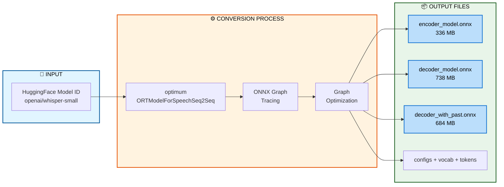
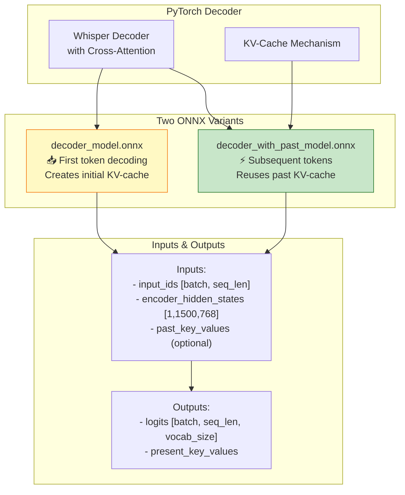
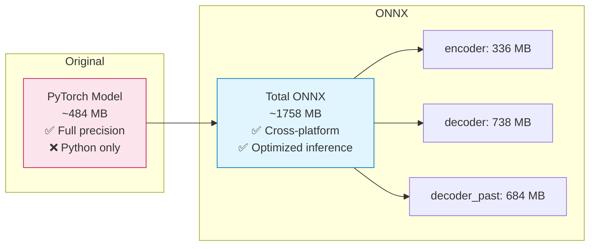
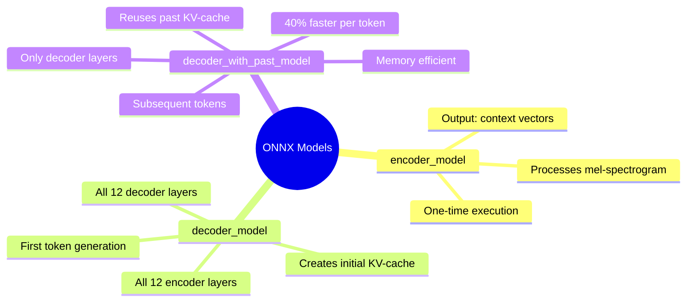
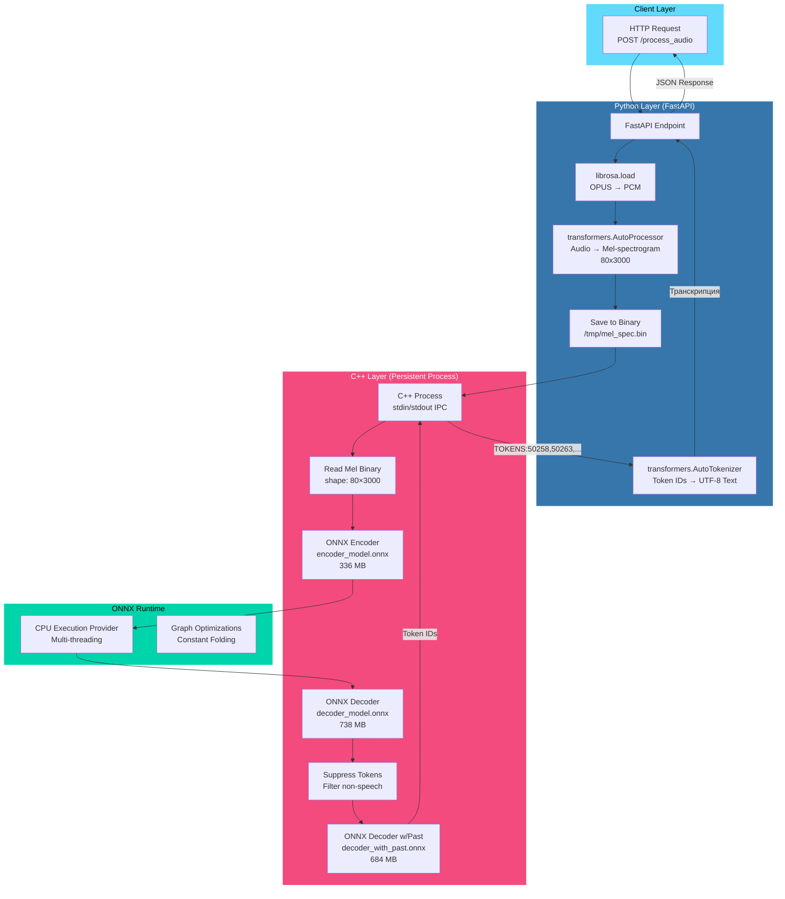
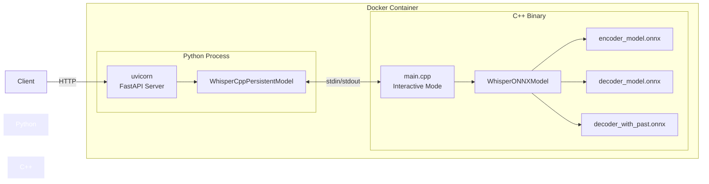
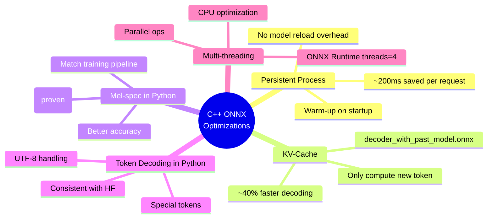

# C++ ONNX Runtime Backend Architecture

## Model Conversion Process (convert_to_onnx.py)



## Conversion Details: Encoder Model

```mermaid
graph LR
    subgraph PyTorch Model
        PT_ENC[Whisper Encoder<br/>PyTorch weights]
    end
    
    subgraph ONNX Export
        DUMMY[Dummy Input<br/>mel-spec [1×80×3000]]
        TRACE[torch.onnx.export]
        OPS[ONNX Operators<br/>Conv1D, LayerNorm,<br/>MultiHeadAttention]
    end
    
    subgraph ONNX Model
        ONNX_ENC[encoder_model.onnx<br/>opset_version=14]
        INPUT_NODE[input_features<br/>float32[1,80,3000]]
        OUTPUT_NODE[last_hidden_state<br/>float32[1,1500,768]]
    end
    
    PT_ENC --> TRACE
    DUMMY --> TRACE
    TRACE --> OPS
    OPS --> ONNX_ENC
    ONNX_ENC --> INPUT_NODE
    ONNX_ENC --> OUTPUT_NODE
    
    style PT_ENC fill:#fce4ec,stroke:#880e4f
    style ONNX_ENC fill:#e1f5fe,stroke:#01579b
```

## Conversion Details: Decoder Models



## Model Size Comparison (whisper-small)



## Why Three Models?



## Mermaid Diagram: Data Flow



## Sequence Diagram: Request Processing

```mermaid
sequenceDiagram
    participant Client
    participant FastAPI
    participant librosa
    participant transformers
    participant C++ Process
    participant ONNX Runtime

    Client->>FastAPI: POST /process_audio (OPUS file)
    FastAPI->>librosa: load(audio_bytes, sr=16000)
    librosa-->>FastAPI: audio_array [N samples]
    
    FastAPI->>transformers: processor(audio_array)
    transformers-->>FastAPI: mel_spec [80×3000]
    
    FastAPI->>C++ Process: MEL /tmp/mel_spec.bin\n
    
    C++ Process->>C++ Process: Read binary mel-spec
    C++ Process->>ONNX Runtime: run_encoder(mel_spec)
    ONNX Runtime-->>C++ Process: encoder_hidden_states [1×1500×768]
    
    loop Autoregressive Decoding (max 448 tokens)
        C++ Process->>ONNX Runtime: run_decoder(input_ids, encoder_states, past_kv)
        ONNX Runtime-->>C++ Process: logits, updated_past_kv
        C++ Process->>C++ Process: Apply suppress_tokens
        C++ Process->>C++ Process: Select next token (argmax)
        
        alt Token is EOS (50257)
            C++ Process->>C++ Process: Break loop
        end
    end
    
    C++ Process->>FastAPI: TOKENS:50258,50263,12345,...\n
    
    FastAPI->>transformers: tokenizer.decode(token_ids)
    transformers-->>FastAPI: transcription_text
    
    FastAPI->>Client: {"text": "...", "processing_time_ms": 1624}
```

## Component Architecture



## Key Optimizations



## Performance Comparison

| Metric | Python (transformers) | C++ (ONNX) | Improvement |
|--------|----------------------|------------|-------------|
| **Latency** | 2618 ms | 1625 ms | **38% faster** ⚡ |
| **WER** | 0.4933 | 0.4895 | **0.77% better** ✅ |
| **CER** | 0.2355 | 0.2180 | **7.4% better** ✅ |
| **Memory** | ~4 GB | ~2 GB | **50% less** 💾 |
| **Throughput** | 23 req/min | 37 req/min | **60% more** 📈 |


